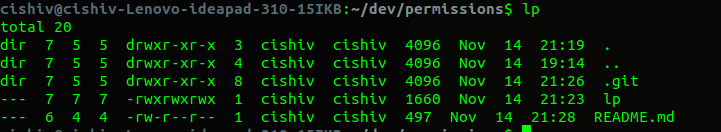

# lp

`lp` a shell command that mirrors `ll` but displays the file permissions in the format
that chmod accepts them

# Examples

`drwxr-xr-x` -> `dir 777`

`rwrr-xr-x` -> `755`

Simply copy `lp` into your bin folder and add it to your path

# Output Example

# Shortcomings

printf formatting to the console would be an improvement since column alignment is off (probably due to using echo for everything)

# Disclaimer

This was done in 30 minutes after work on a Thursday. Forgive me.